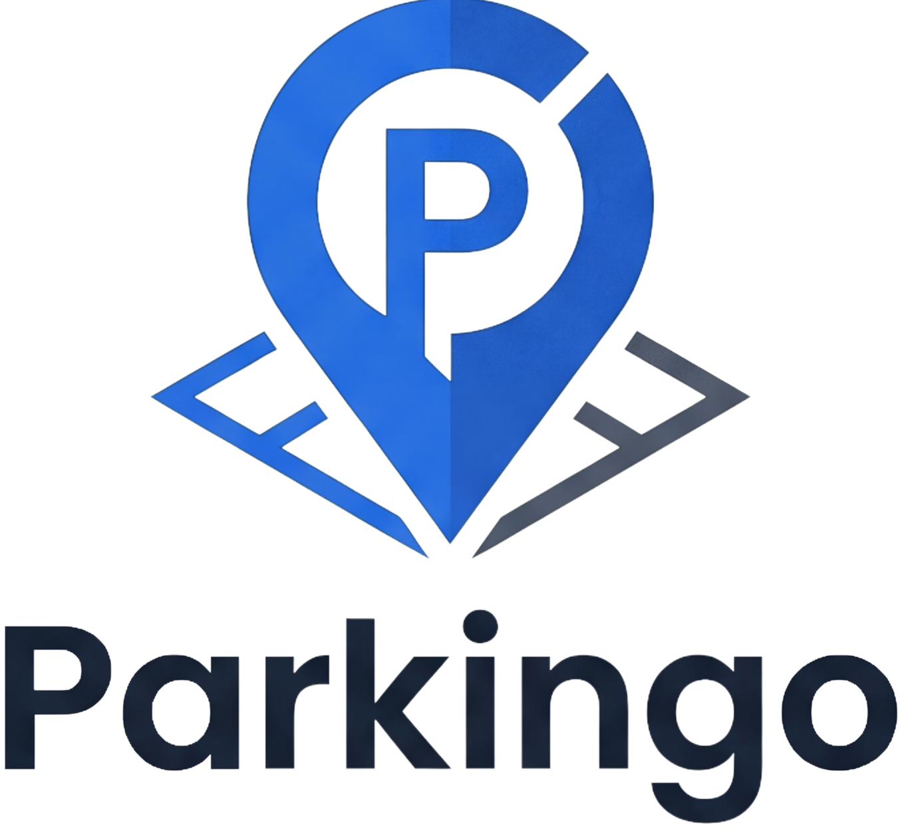

<div align="center">
  

  # SmartParkinGo

  **Smart parking made simple — find, book and manage parking spots in real time.**
</div>

---

## 🚗 About

SmartParkinGo is a multi-platform parking management solution that connects drivers, parking owners, and security guards. The system streamlines spot discovery, reservations, access control, and analytics in one ecosystem.

## 📦 Project Structure

| Module | Description | Tech |
|--------|-------------|------|
| `mobile/` | Driver mobile app — find & book parking spots | Flutter |
| `frontend/` | Web dashboard for users and admins | React |
| `Backend/` | Core API and business logic | Node.js |
| `owner-analytics/` | Analytics & video processing for parking owners | Python |
| `guard-alpr/` | Automatic License Plate Recognition for guards | Python / ALPR |

## ✨ Features

- 🅿️ Real-time parking spot availability
- 📍 Map-based search with Mapbox integration
- 📱 Cross-platform mobile app (iOS & Android)
- 📊 Analytics dashboard for parking owners
- 🎥 ALPR-based access control for guards
- 🤖 AI assistance powered by Gemini

## 🚀 Getting Started

Each module has its own setup instructions. To run a component:

```bash
# Mobile app
cd mobile && flutter pub get && flutter run

# Web frontend
cd frontend && npm install && npm run dev

# Backend API
cd Backend && npm install && npm start

# Analytics worker
cd owner-analytics && pip install -r requirements.txt && python worker.py
```

## 🔐 Configuration

The mobile app reads secrets from environment variables via `--dart-define`:

```bash
flutter run --dart-define=MAPBOX_TOKEN=pk.xxx --dart-define=GEMINI_API_KEY=xxx
```

## 📄 License

This project is for educational purposes (EMSI - S8).
